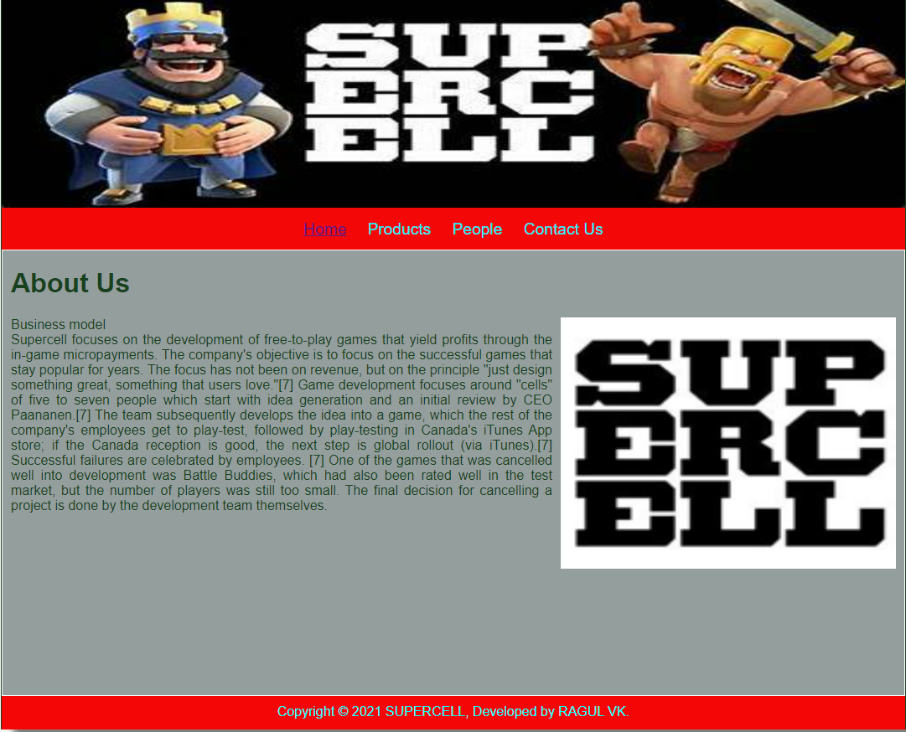
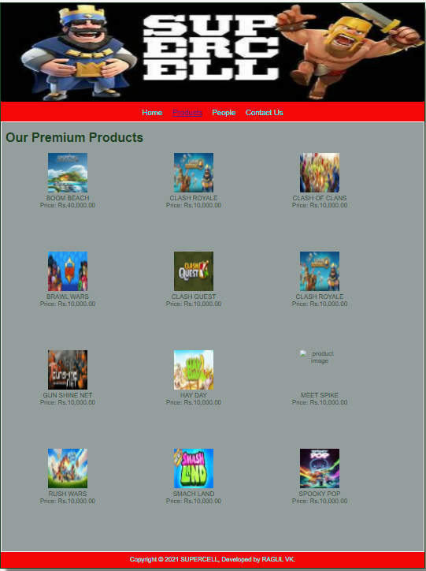
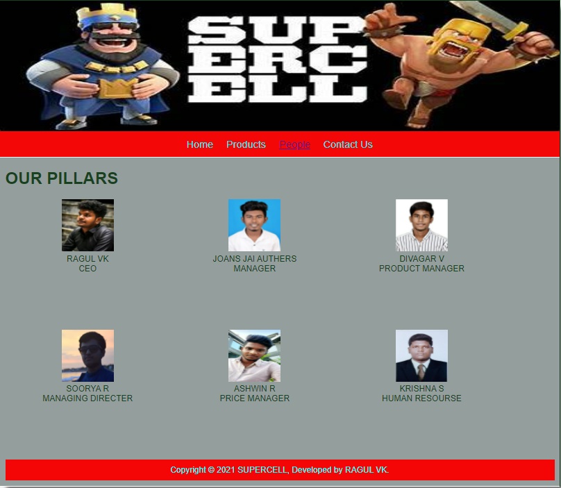
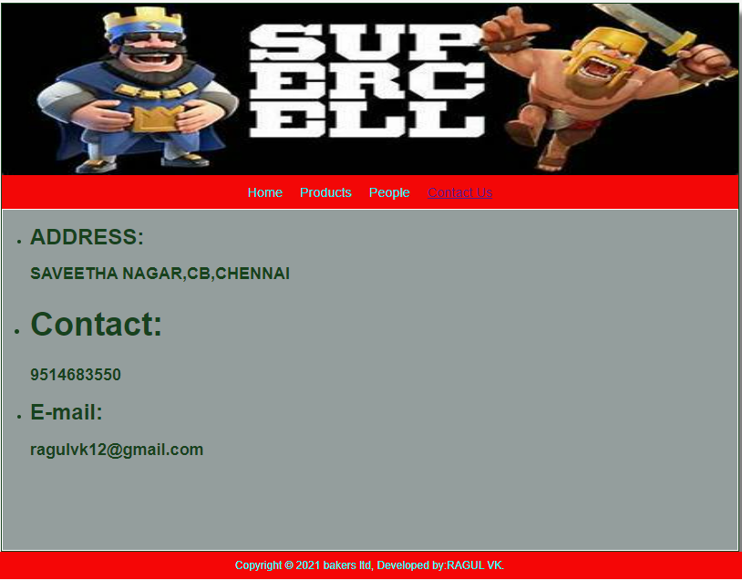

# Web Design for a Software Product Company

## AIM:

To design a static website for a software product company company.

## DESIGN STEPS:

### Step 1:

Requirement collection.

### Step 2:

Creating the layout using HTML and CSS.

### Step 3:

Updating the sample content.

### Step 4:

Choose the appropriate style and color scheme.

### Step 5:

Validate the layout in various browsers.

### Step 6:

Validate the HTML code.

### Step 6:

Publish the website in the given URL.

## PROGRAM :
###CSS CODE
```
* {
  box-sizing: border-box;
  font-family: Arial, Helvetica, sans-serif;
}
body {
  background-color: whitesmoke;
  color: #17421d;
}
.container {
  width: 1080px;
  margin-left: auto;
  margin-right: auto;
  border-width: 1px 1px 1px 1px;
  border-style: solid;
  box-shadow: 15px 15px 8px gray;
}

.banner {
  display: block;
  width: 100%;
  height: 250px;
  text-align: center;
  font-size: 60px;
  background-image: url("/static/img/super-cell.jpg");
  background-size: 100% 100%;
  margin: 0px 0px 0px 0px;
  padding-top: 150px;
  color: #16d1ae;
}

.menu {
  display: block;
  width: 100%;
  height: 50px;
  font-size: larger;
  background-color: #f30707;
  text-align: center;
  padding-top: 15px;
  margin: 0px 0px 0px 0px;
  border-width: 1px;
}

.menuitem {
  display: inline-block;
  margin-left: 10px;
  margin-right: 10px;
}
.menuitemselected {
  display: inline-block;
  margin-left: 10px;
  margin-right: 10px;
  color: #f70411;
}

.menuitem a {
  text-decoration: none;
  color: #01eef7;
}

.content {
  display: block;
  width: 100%;
  background-color: #949e9d;
  min-height: 500px;
  margin: 0px 0px 0px 0px;
  border-width: 1px;
  border-color: white;
  border-style: solid;
}
.homecontent {
  min-height: 500px;
  margin: 10px 10px 10px 10px;
}
.homecontent h1 {
  text-align: left;
}
.homecontent img {
  float: right;
  width: 400px;
  height: 300px;
  margin-left: 10px;
}

.contenttext {
  text-align: justify;
}

.productcontent {
  min-height: 500px;
  margin: 10px 10px 10px 10px;
}

.productcontent h1 {
  text-align: left;
}

.productitems {
  display: block;
}

.productitem {
  display: inline-block;
  width: 30%;
  height: 250px;
  text-align: center;
}

.productitem img {
  width: 100px;
  height: 100px;
  display: block;
}
.productitem .itemimage {
  display: block;
  margin-left: auto;
  margin-right: auto;
  width: 100px;
  margin-bottom: 5px;
}

.productitem .itemname {
  display: block;
}
.productitem .itemprice {
  display: block;
}

.footer {
  display: block;
  width: 100%;
  height: 40px;
  background-color: #f50606;
  text-align: center;
  padding-top: 10px;
  margin: 0px 0px 0px 0px;
  color: #00ffff;
}
```
###HOME CODE
```
<!DOCTYPE html>
<html lang="en">
  <head>
    <title>SUPERCELL</title>
    <link rel="stylesheet" href="./css/layout.css" />
    <link rel="icon" href="./img/icon.png" type="image/x-icon" />
  </head>

  <body>
    <div class="container">
      <div class="banner"></div>
      <div class="menu">
        <div class="menuitemselected"><a href="/static/home.html">Home</a></div>
        <div class="menuitem"><a href="/static/products.html">Products</a></div>
        <div class="menuitem"><a href="/static/people.html">People</a></div>
        <div class="menuitem"><a href="/static/contactus.html">Contact Us</a></div>
      </div>
      <div class="content">
        <div class="homecontent">
          <h1>About Us</h1>
          
          <div class="contenttext">
            Business model
            <br>
            Supercell focuses on the development of free-to-play games that
            yield profits through the in-game micropayments. The company's 
            objective is to focus on the successful games that stay popular for years.
            The focus has not been on revenue, but on the principle "just design something 
            great, something that users love."[7] Game development focuses around "cells" of 
            five to seven people which start with idea generation and an initial review by 
            CEO Paananen.[7] The team subsequently develops the idea into a game, which the 
            rest of the company's employees get to play-test, followed by play-testing in 
            Canada's iTunes App store; if the Canada reception is good, the next step is global 
            rollout (via iTunes).[7] Successful failures are celebrated by employees.
            [7] One of the games that was cancelled well into development was Battle Buddies, 
            which had also been rated well in the test market, but the number of players was still 
            too small. The final decision for cancelling a project is done by the development 
            team themselves.

            
            </ul>
          </div>
        </div>
      </div>
      <div class="footer">
        Copyright &#169; 2021 SUPERCELL, Developed by RAGUL VK.
      </div>
    </div>
  </body>
</html>
```
###PRODUCT CODE
```
<!DOCTYPE html>
<html lang="en">
  <head>
    <title>SUPERCELL</title>
    <link rel="stylesheet" href="./css/layout.css" />
    <link rel="icon" href="./img/icon.png" type="image/x-icon" />
  </head>

  <body>
    <div class="container">
      <div class="banner"></div>
      <div class="menu">
        <div class="menuitem"><a href="/static/home.html">Home</a></div>
        <div class="menuitemselected"><a href="/static/products.html">Products</a></div>
        <div class="menuitem"><a href="/static/people.html">People</a></div>
        <div class="menuitem"><a href="/static/contactus.html">Contact Us</a></div>
      </div>
      <div class="content">
        <div class="productcontent">    
          <h1>Our Premium Products</h1>
          <div class="productitems">
              <div class="productitem"> 
                  <div class="itemimage">
                  
                  </div>
                  <div class="itemname">BOOM BEACH</div>
                  <div class="itemprice">Price: Rs.40,000.00 </div>
              </div>
              <div class="productitem"> 
                  <div class="itemimage">
                  
                  </div>
                  <div class="itemname">CLASH ROYALE</div>
                  <div class="itemprice">Price: Rs.10,000.00 </div>
              </div>
              <div class="productitem"> 
                <div class="itemimage">
                
                </div>
                <div class="itemname">CLASH OF CLANS</div>
                <div class="itemprice">Price: Rs.10,000.00 </div>
            </div>
            <div class="productitem"> 
              <div class="itemimage">
              
              </div>
              <div class="itemname">BRAWL WARS</div>
              <div class="itemprice">Price: Rs.10,000.00 </div>
          </div>
          <div class="productitem"> 
            <div class="itemimage">
            
            </div>
            <div class="itemname">CLASH QUEST</div>
            <div class="itemprice">Price: Rs.10,000.00 </div>
        </div>
        <div class="productitem"> 
          <div class="itemimage">
          
          </div>
          <div class="itemname">CLASH ROYALE</div>
          <div class="itemprice">Price: Rs.10,000.00 </div>
      </div>
      <div class="productitem"> 
        <div class="itemimage">
        
        </div>
        <div class="itemname">GUN SHINE NET</div>
        <div class="itemprice">Price: Rs.10,000.00 </div>
    </div>
    <div class="productitem"> 
      <div class="itemimage">
      
      </div>
      <div class="itemname">HAY DAY</div>
      <div class="itemprice">Price: Rs.10,000.00 </div>
  </div>
  <div class="productitem"> 
    <div class="itemimage">
    
    </div>
    <div class="itemname">MEET SPIKE</div>
    <div class="itemprice">Price: Rs.10,000.00 </div>
</div>
<div class="productitem"> 
  <div class="itemimage">
  
  </div>
  <div class="itemname">RUSH WARS</div>
  <div class="itemprice">Price: Rs.10,000.00 </div>
</div>
<div class="productitem"> 
  <div class="itemimage">
  
  </div>
  <div class="itemname">SMACH LAND</div>
  <div class="itemprice">Price: Rs.10,000.00 </div>
</div>
<div class="productitem"> 
  <div class="itemimage">
  
  </div>
  <div class="itemname">SPOOKY POP</div>
  <div class="itemprice">Price: Rs.10,000.00 </div>
</div>
          </div>
          </div>        
      </div>
      <div class="footer">
        Copyright &#169; 2021 SUPERCELL, Developed by RAGUL VK.
      </div>
    </div>
  </body>
</html>
```
###PEOPLE CODE
```
<!DOCTYPE html>
<html lang="en">
  <head>
    <title>SUPERCELL</title>
    <link rel="stylesheet" href="./css/layout.css" />
    <link rel="icon" href="./img/icon.png" type="image/x-icon" />
  </head>

  <body>
    <div class="container">
      <div class="banner"></div>
      <div class="menu">
        <div class="menuitem"><a href="/static/home.html">Home</a></div>
        <div class="menuitem"><a href="/static/products.html">Products</a></div>
        <div class="menuitemselected"><a href="/static/people.html">People</a></div>
        <div class="menuitem"><a href="/static/contactus.html">Contact Us</a></div>
      </div>
      <div class="content">
        <div class="productcontent">    
          <h1>OUR PILLARS</h1>
          <div class="productitems">
              <div class="productitem"> 
                  <div class="itemimage">
                  
                  </div>
                  <div class="itemname">RAGUL VK</div>
                  <div class="itemprice">CEO</div>
              </div>
              <div class="productitem"> 
                  <div class="itemimage">
                  
                  </div>
                  <div class="itemname">JOANS JAI AUTHERS</div>
                  <div class="itemprice">MANAGER</div>
              </div>
              <div class="productitem"> 
                <div class="itemimage">
                
                </div>
                <div class="itemname">DIVAGAR V</div>
                <div class="itemprice">PRODUCT MANAGER</div>
          </div>
          <div class="productitem"> 
            <div class="itemimage">
            
            </div>
            <div class="itemname">SOORYA R</div>
            <div class="itemprice">MANAGING DIRECTER</div>
          </div>
          <div class="productitem"> 
            <div class="itemimage">
            
            </div>
            <div class="itemname">ASHWIN R</div>
            <div class="itemprice">PRICE MANAGER</div>        
      </div>
      <div class="productitem"> 
        <div class="itemimage">
        
        </div>
        <div class="itemname">KRISHNA S</div>
        <div class="itemprice">HUMAN RESOURSE</div>
      </div>
      <div class="footer">
        Copyright &#169; 2021 SUPERCELL, Developed by RAGUL VK.
      </div>
    </div>
  </body>
</html>
```
###CONTACTUS CODE
```
<!DOCTYPE html>
<html lang="en">
  <head>
    <title>SUPERCELL</title>
    <link rel="stylesheet" href="./css/layout.css" />
    <link rel="icon" href="./img/icon.png" type="image/x-icon" />
  </head>

  <body>
    <div class="container">
      <div class="banner"></div>
      <div class="menu">
        <div class="menuitem"><a href="/static/home.html">Home</a></div>
        <div class="menuitem"><a href="/static/products.html">Products</a></div>
        <div class="menuitem"><a href="/static/people.html">People</a></div>
        <div class="menuitemselected"><a href="/static/contactus.html" >Contact Us</a></div>
      </div>
      <div class="content">
        <ul>
            <li><h1>ADDRESS:</h1></li>
            <h2>SAVEETHA NAGAR,CB,CHENNAI<h2>
            <li><h1>Contact:</h1></li>
            <h2>9514683550</h2>
            <li><h1>E-mail:</h1></li>
            <h2>ragulvk12@gmail.com</h2>
            
        </ul>    
      </div>
  </div>
  </div>
  </div>
    <div class="footer">
      Copyright &#169; 2021 bakers ltd, Developed by:RAGUL VK.
    </div>
  </div>
</body>
</html>
```
## OUTPUT:

### Home Page:


### PRODUCT PAGE:

### PEOPLE PAGE:

### CONTACTUS PAGE:

## Result:

Thus a website is designed for the software product company and the HTML,CSS code are validated.
